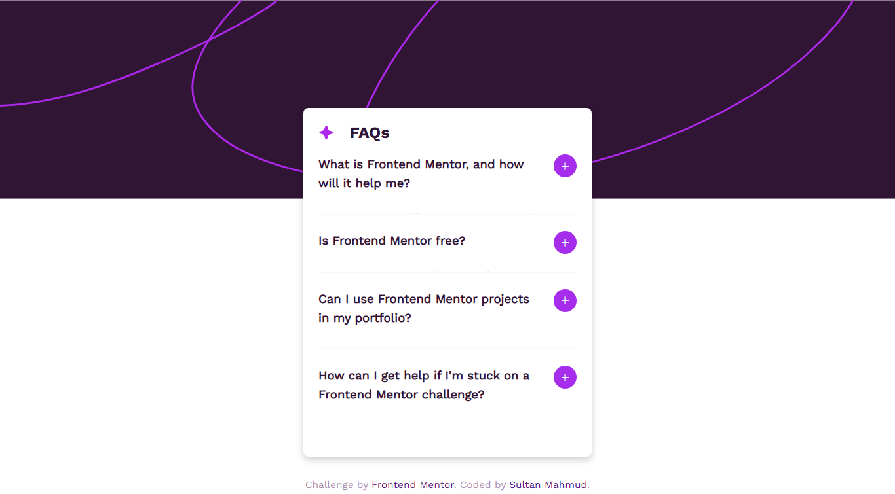
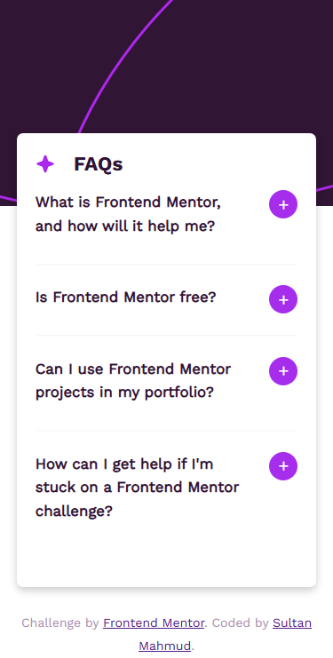
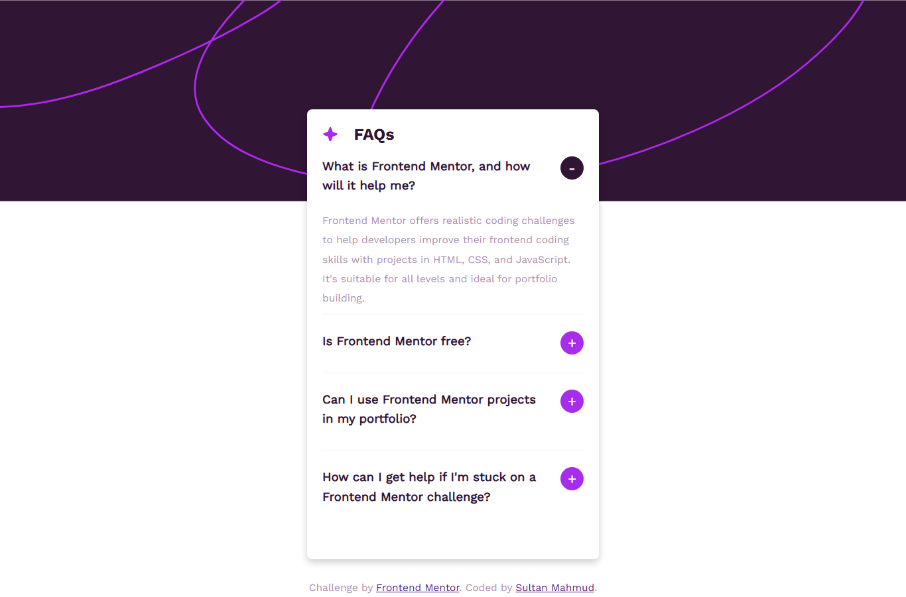

# Frontend Mentor - FAQ accordion solution

This is a solution to the [FAQ accordion challenge on Frontend Mentor](https://www.frontendmentor.io/challenges/faq-accordion-wyfFdeBwBz). Frontend Mentor challenges help you improve your coding skills by building realistic projects. 

## Table of contents

- [Overview](#overview)
  - [The challenge](#the-challenge)
  - [Screenshot](#screenshot)
  - [Links](#links)
- [My process](#my-process)
  - [Built with](#built-with)
  - [What I learned](#what-i-learned)
  - [Continued development](#continued-development)
  - [Useful resources](#useful-resources)
- [Author](#author)
- [Acknowledgments](#acknowledgments)

## Overview
- A single page accordion application to find frequently asked question
- 
### Features

Users would be able to:

- Hide/Show the answer to a question when the question is clicked
- Navigate the questions and hide/show answers using keyboard navigation alone
- View the optimal layout for the interface depending on their device's screen size
- See hover and focus states for all interactive elements on the page

### Screenshot

#### Desktop preview


#### Mobile preview


#### Active preview


### Links

- Solution URL: [Get the codes](https://github.com/developer-sultan/faq-accordion)
- Live Site URL: [Demo](https://faq-accordion-ten-ashy.vercel.app/);

## My process

### Built with

- Semantic HTML5 markup
- CSS custom properties
- Flexbox
- Mobile-first workflow

### What I learned

In this project I learned js script that able to navigate the accordion by keyboard

My code snippets, see below:

```js
const accordion = document.querySelectorAll(".faq-card_summary");

// Hide/Show answer when question is clicked
for(let i = 0; i < accordion.length; i++){
    accordion[i].addEventListener(("click"), faqToggle);
}

// Hide/Show answer using keyboard navigation

for(let i = 0; i < accordion.length; i++){
    accordion[i].addEventListener("keydown",function(event){
        if(event.key ===  "Enter" || event.key === " " || event.key === "Tab"){
            faqToggle.call(this);
        }
    });
}

// Hide/Show answer main function
function faqToggle(){
    this.classList.toggle("active");
    let panel = this.nextElementSibling;
    if(panel.style.maxHeight){
        panel.style.maxHeight = null;
    }else{
        panel.style.maxHeight = panel.scrollHeight + "px";
    }
}
```

## Author

- Fcebook - [Sultan Mahmud](https://www.facebook.com/sultanmahmud.dev/)
- Frontend Mentor - [@developer-sultan]([https://www.frontendmentor.io/profile/yourusername](https://www.frontendmentor.io/profile/developer-sultan))
- Twitter - [@sultanmahmud404](https://x.com/sultanmahmud404)
